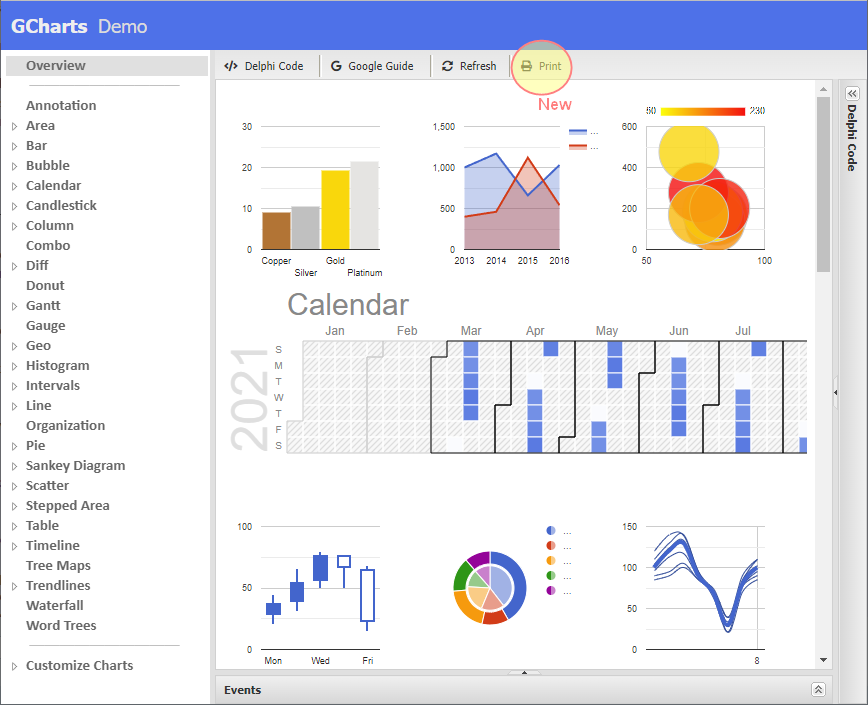
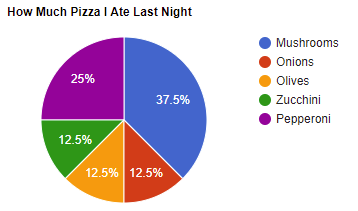
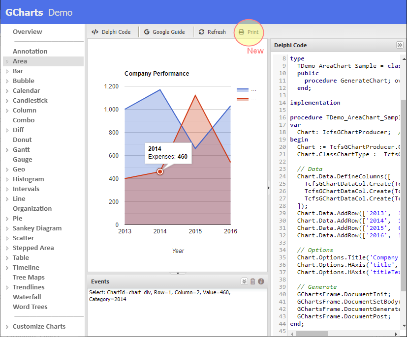

## What's Delphi-GCharts

Delphi-GCharts is a Delphi library of components to generate Charts in uniGUI Framework using the Google Charts API. 





Currently it supports  these Google Chart classes: 

| Chart Class | Chart Class |  Chart Class   | Chart Class |
| :---------: | :---------: | :------------: | :---------: |
| Annotation  |    Combo    |   Intervals    |    Table    |
|    Area     |    Diff     |      Line      |  Timeline   |
|     Bar     |    Donut    |  Organization  |  Tree Maps  |
|   Bubble    |    Gantt    |      Pie       | Trendlines  |
|  Calendar   |    Gauge    | Sankey Diagram |  Waterfall  |
| Candlestick |     Geo     |    Scatter     | Word Trees  |
|   Column    |  Histogram  |  Stepped Area  |             |


## The components

The library has two main components the non-visual component **TcfsGChartProducer** and the visual component **TuniGChartsFrame**.

The **TcfsGChartProducer** component is responsible for generating the javascript code according to the data and options of the class chart to be generated. 

The **TuniGChartsFrame** component is used to view and interact with the Chart produced by **TcfsGChartProducer**.

## Install

**cfsCharts** has been coded in Delphi 10.4 Sydney and uniGUI Version:1.90.0 build 1549, but surely can be compiled into earlier versions.

Install the visual component **cfs.Charts.uniGUI.dpk** that is in the uniGUI folder and also **add** to the **search path** the **sources** folder.


## Basic Use Example

Basic example to generate this Pie Chart:



````Delphi
unit Main;

interface

uses
  Windows, Messages, SysUtils, Variants, Classes, Graphics,
  Controls, Forms, uniGUITypes, uniGUIAbstractClasses,
  uniGUIClasses, uniGUIRegClasses, uniGUIForm, uniGUIBaseClasses,
  cfs.GCharts.uniGUI;

type
  TMainForm = class(TUniForm)
    uniGChartsFrame1: TuniGChartsFrame;
    procedure UniFormCreate(Sender: TObject);
  private
  public
  end;

function MainForm: TMainForm;

implementation

{$R *.dfm}

uses
  uniGUIVars, MainModule, cfs.GCharts; // <--- Add this unit

function MainForm: TMainForm;
begin
  Result := TMainForm(UniMainModule.GetFormInstance(TMainForm));
end;

procedure TMainForm.UniFormCreate(Sender: TObject);
var
  Chart: IcfsGChartProducer; //Defined as TInterfacedObject. No need try..finally
begin
  Chart := TcfsGChartProducer.Create;
  Chart.ClassChartType := TcfsGChartProducer.CLASS_PIE_CHART;

  // Data
  Chart.Data.DefineColumns([
    TcfsGChartDataCol.Create(TcfsGChartDataType.gcdtString, 'Topping'),
    TcfsGChartDataCol.Create(TcfsGChartDataType.gcdtNumber, 'Slices')
  ]);
  Chart.Data.AddRow(['Mushrooms', 3]);
  Chart.Data.AddRow(['Onions', 1]);
  Chart.Data.AddRow(['Olives', 1]);
  Chart.Data.AddRow(['Zucchini', 1]);
  Chart.Data.AddRow(['Pepperoni', 2]);

  // Options
  Chart.Options.Title('How Much Pizza I Ate Last Night');

  // Generate
  uniGChartsFrame1.DocumentInit;
  uniGChartsFrame1.DocumentSetBody('<div id="Chart" style="width:100%;height:100%;"></div>');
  uniGChartsFrame1.DocumentGenerate('Chart', Chart);
  uniGChartsFrame1.DocumentPost;
end;


````


## Demo Application

The library includes in demos folder the **GChartsDemo** project with several examples that show how to build the different class charts.




When running the demo you can:

- Display the **Delphi Code** used to generate the Chart
- Click **Google Guide** button to see the official documentation of Google Charts.
- Click on the Chart  to see events fired


------

## Star this project


Please, if you use **Delphi GCharts** "star" this project in GitHub! It cost nothing to you but helps other developers to reference the code.


